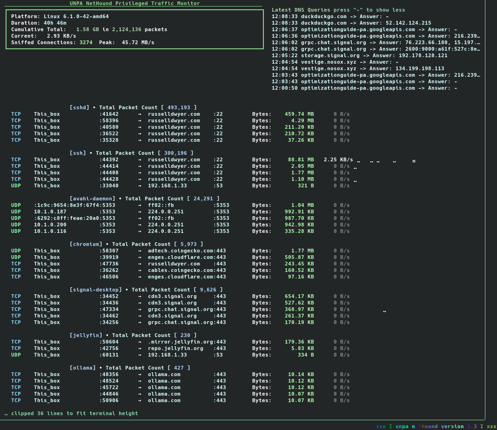
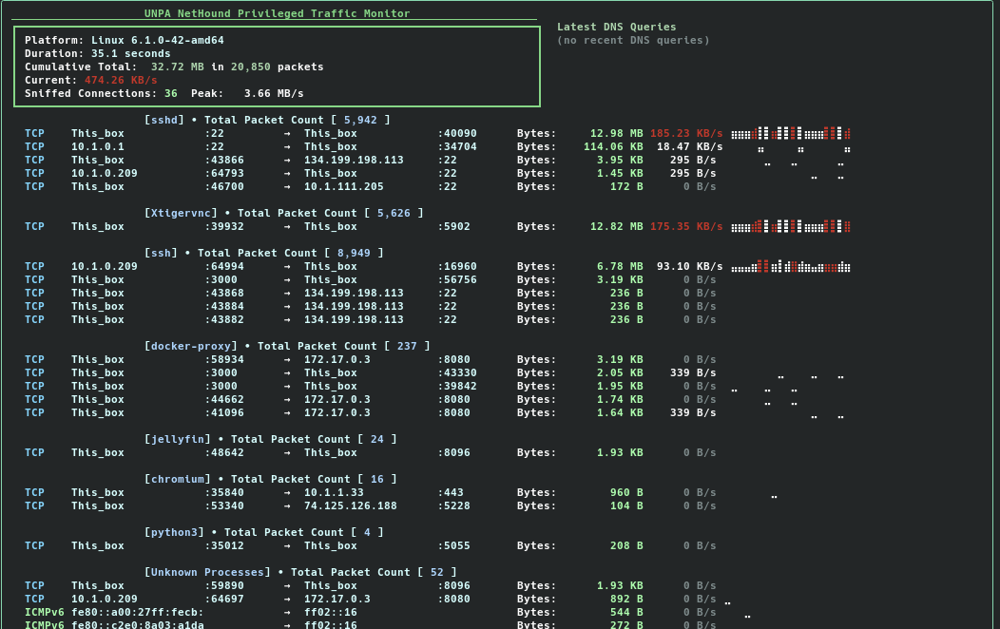
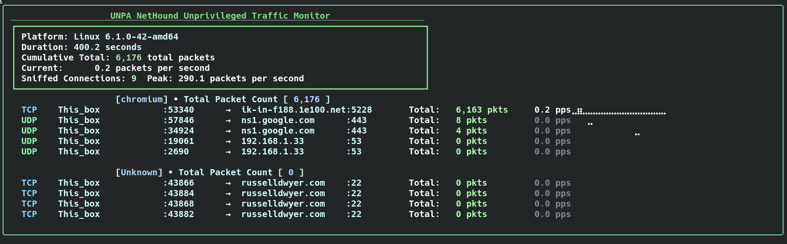

**unpa.py network protocol analyzer**
# Be like water, my friend. Flow with the network.

UNPA NetHound: single-file real-time terminal network analyzer. Run as root/sudo for privileged capture; run unprivileged and it automatically falls back to the psutil-based analyzer. Pure Python stdlib, with psutil only for the unprivileged path. Linux raw sockets (post-softIRQ). macOS tcpdump fallback.

## Installation

### pip
```bash
pip install unpa
sudo unpa
```

### Homebrew (macOS/Linux)
```bash
brew install greenfan/tools/unpa
sudo unpa
```

### From source
```bash
git clone https://github.com/greenfan/unpa.git
cd unpa && sudo python3 unpa.py
```

## Features
- Ethernet/IPv4/IPv6 + TCP/UDP/ICMP/DNS parsing.
- Connection tracking: bytes/pkts by proto/IP/port.
- Intuitive DNS query display
- Intuitive filters: local/LAN/extra IPs, processes, groups.
- Compact tui: All based in the terminal. No other interface needed.
- Linux/macOS. Featuring both linux and macOS socket tracing and polling, for unprivileged usage, as well as a more comprehensive set of tracing capability if run as root.
- Designed initially to track active throughput from the CLI on a VyOS firewall. This can be used on virtually any linux/unix system, with python3

### Synopsis
```bash
sudo python3 unpa.py [flags]
```

If no flags are given, default behavior is: `python3 unpa.py` → `-t1 -n -e -g -r`

`-o` alone → `-t1 -n -g`

## Flags
| Flag | Description |
|------|-------------|
| `-n` | No localhost (127.0.0.0/24) |
| `-e` | No LAN (RFC1918; DNS bypass) |
| `-ee CIDR/IP` | Extra excludes (repeatable) |
| `-ii CIDR/IP/DOMAIN` | Include only (repeatable; resolves domains) |
| `-nodns` | Filter DNS like LAN |
| `-t SEC` | Refresh (def:10) |
| `-c N` | Max lines (def:20) |
| `-p NAME` | Process filter |
| `-g` | Group by process |
| `-d N` | DNS lines (def:5) |
| `-xx` | Truncate 60 lines |
| `-r` | Resolve IPs |
| `-i IFACE` | Interface (en0/eth0) |
| `-o` | Quick: `-t1 -n -g` (solo) |

**Key**: `-` toggles DNS panel (compact ↔ expand).

## Examples
```bash
sudo python3 unpa.py          # Default hunt
sudo python3 unpa.py -o       # Quick groups
sudo python3 unpa.py -t2 -g -r
sudo python3 unpa.py -ee 208.10.10.11 -ee 207.10.0.0/16
sudo python3 unpa.py -ii google.com -g -r
sudo python3 unpa.py -e -nodns
```

## Notes
- Root for raw capture.
- Fork/tweak. See `tcpdump_raw_parser` branch.
- Hunt anomalies. Stay formless.

## Screenshots

<p align="center">
  
  
  
</p>

<p align="center"><em>Privileged capture on the left and center; unprivileged fallback on the right.</em></p>
